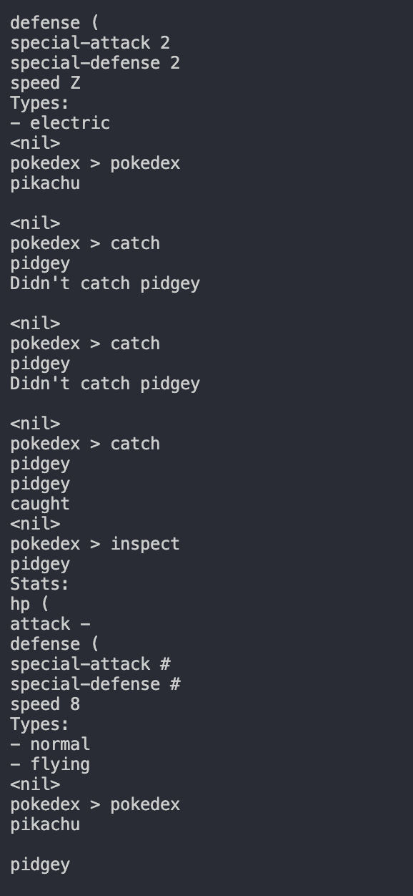

# goPractice
Using external API to nail down Go concepts such as HTTP, caching, structs and handling JSON data from the pokemon API. 

Currently supports, 7 commands, letting the users catch the pokemons, browse the map and inspect their inventory of caught pokemons

